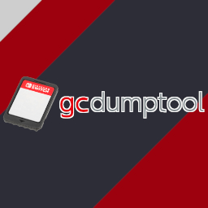

# nxdumptool

Nintendo Switch Dump Tool

## The application is being rewritten from scratch to improve things such as code quality, maintainability and readability.

## All the changes will be pushed to this branch once the new codebase reaches an usable + stable state. Sorry for any possible inconveniences.

## Official Discord server: https://discord.gg/SCbbcQx.

Main features
--------------

* Generates NX Card Image (XCI) dumps from the inserted gamecard, with optional certificate removal and/or trimming.
* Generates installable Nintendo Submission Packages (NSP) from base applications, updates and DLCs stored in the inserted gamecard, SD card and eMMC storage devices.
    * The generated dumps follow the `AuditingTool` format from Scene releases.
    * Capable of generating dumps without console specific information (common ticket).
    * Capable of generating ticket-less (standard crypto) dumps.
    * Capable of generating dumps from installed updates/DLCs with missing base applications (orphan titles).
    * Compatible with game pre-installs.
    * Batch mode available, with customizable dump settings.
* Manual gamecard certificate dump.
* Manual ticket dump from installed SD/eMMC titles + optional removal of console specific data.
* Compatible with multigame carts.
* CRC32 checksum calculation for XCI/NSP dumps.
* XCI/NSP dump verification through CRC32 checksum lookup.
    * Using offline XML database from NSWDB.COM (NSWreleases.xml) (XCI only).
    * Performing an online lookup against the No-Intro database.
* Bundled-in update capabilities via libcurl.
    * Update to the latest version by downloading it right from GitHub.
    * Update the NSWDB.COM XML database.
* Precise HFS0 raw partition dumping, using the root HFS0 header from the gamecard.
* HFS0 partition file data dumping + browser with manual file dump support.
* Program NCA ExeFS/RomFS section & Data NCA RomFS section file data dumping + browser with manual file dump support.
    * Compatible with base applications, updates and DLCs (if available).
    * Supports manual RomFS directory dumping.
* Free SD card space checks in place.
* File splitting support for all operations.
    * Capable of storing split XCI/NSP dumps in directories with the archive bit set.
* Sequential (multi-session) dump support, in case there's not enough storage space available for a XCI/NSP full dump.
* Metadata retrieval using NCM and NS services.
* Dump speed calculation, ETA calculation and progress bar.

Operations related to installed SD/eMMC titles require a keys file located at "sdmc:/switch/prod.keys". Use [Lockpick_RCM](https://github.com/shchmue/Lockpick_RCM) to generate it.

Please launch the application through title override (hold R while launching a game) whenever possible to avoid memory allocation problems.

Thanks to
--------------

* [MCMrARM](https://github.com/MCMrARM), for creating the original application.
* [RSDuck](https://github.com/RSDuck), for vba-next-switch port. Its UI menu code was taken as a basis for this application.
* [foen](https://github.com/foen), for giving me some pretty good hints about how to use the NCM service.
* [yellows8](https://github.com/yellows8), for helping me fix a silly bug in my implementation of some NCM service IPC calls.
* [SciresM](https://github.com/SciresM), for [hactool](https://github.com/SciresM/hactool) (licensed under [ISC](https://github.com/SciresM/hactool/blob/master/LICENSE)). Its NCA content handling procedures are reproduced in many parts of the application.
* [The-4n](https://github.com/The-4n), for [4NXCI](https://github.com/The-4n/4NXCI) (licensed under [ISC](https://github.com/The-4n/4NXCI/blob/master/LICENSE)) and [hacPack](https://github.com/The-4n/hacPack) (licensed under [GPLv2](https://github.com/The-4n/hacPack/blob/master/LICENSE)). The NCA content patching procedure used in 4NXCI is replicated in the application, as well as the NACP XML generation from hacPack.
* [shchmue](https://github.com/shchmue), for [Lockpick](https://github.com/shchmue/Lockpick) (licensed under [GPLv2](https://github.com/shchmue/Lockpick/blob/master/LICENSE)). It is used as a reference for the runtime key-collection algorithm needed for the NSP dump, ExeFS dump/browse and RomFS dump/browse procedures.
* Björn Samuelsson, for his [public domain CRC32 checksum calculation C-code](http://home.thep.lu.se/~bjorn/crc).
* [Adubbz](https://github.com/Adubbz), for [Tinfoil](https://github.com/Adubbz/Tinfoil) (licensed under [MIT](https://github.com/Adubbz/Tinfoil/blob/master/LICENSE)). Its wrappers for ES service IPC calls are used in the application.
* [WerWolv](https://github.com/WerWolv), for the SX OS detection procedure used in [EdiZon](https://github.com/WerWolv/EdiZon) (licensed under [GPLv2](https://github.com/WerWolv/EdiZon/blob/master/LICENSE)).
* ChaN, for the [FatFs module](http://elm-chan.org/fsw/ff/00index_e.html) (licensed under [FatFs license](http://elm-chan.org/fsw/ff/doc/appnote.html#license)). It is used to read ES savedata files from the BIS System partition.
* [hthh](https://github.com/hthh), for his [switch-reversing](https://github.com/hthh/switch-reversing) repository, which was very helpful to understand how to parse and read information from NSO binaries.
* The [LZ4 project](http://www.lz4.org), for the LZ4 C-code implementation (licensed under [BSD 2-Clause](https://github.com/lz4/lz4/blob/master/lib/LICENSE)).
* [AnalogMan](https://github.com/AnalogMan151) and [0Liam](https://github.com/0Liam), for their constant support and ideas.
* [RattletraPM](https://github.com/RattletraPM), for the awesome icon used in the application.
* [FennecTECH](https://github.com/fennectech), for testing / breaking stuff inside the application on a regular basis.
* The folks from NSWDB.COM and No-Intro.org, for being kind enough to put up a HTTP(S) endpoint(s) to perform CRC32 checksum lookups.
* The GNOME project, from which the [high contrast icons](https://commons.wikimedia.org/wiki/GNOME_High_contrast_icons) were retrieved.
* The folks from ReSwitched, for working towards the creation of a good homebrew ecosystem.
* The Comfy Boyes, for being both awesome and supportive. You know who you are.
* My girlfriend, for putting up with me even though I dedicate most of my free time to this little project, and for doing her best to cheer me up and keep me going. I love you.

Changelog
--------------

**v1.1.13:**

* Fixed compatibility with latest libnx release.
* Now using the `AtmosphereHasService` SM API extension to check if a service is running. More than a year and a half has passed since this feature was introduced in Atmosphère, and it is now part of both SX OS and ReiNX, so it's a justified change. Fixes issues related to sysmodules and SM port exhaustion.

This is only a bugfix release. I don't expect to release any new versions until the rewrite is finished - the only exception being fixing some kind of feature-breaking bug. Please understand.

**v1.1.12:**

* Fixed RomFS dumping/browsing support for games with base Program NCAs without a RomFS section (e.g. Fortnite, World of Tanks Blitz, etc.). Big thanks to [bigkahuna666](https://github.com/bigkahuna666) for reporting the issue and providing with testing.

This is only a bugfix release. I don't expect to release any new versions until the rewrite is finished - the only exception being fixing some kind of feature-breaking bug. Please understand.

**v1.1.11:**

* Built using libnx `f01fb21`.
* The application will now only attempt to decrypt the eTicket device RSA keypair if the target title uses a ticket with personalized titlekey crypto, instead of always decrypting it regardless of the ticket crypto type.
* Fixed a NSP dumping issue where the decrypted titlekey wasn't being set for the current NCA if both the ticket and the decrypted titlekey were retrieved while parsing a previous NCA. Big thanks to [sadboys2001](https://github.com/sadboys2001) for reporting it.

This is only a bugfix release. I don't expect to release any new versions until the rewrite is finished - the only exception being fixing some kind of feature-breaking bug. Please understand.

**v1.1.10:**

* Built using libnx v3.1.0.
* Updated save.c/h to reflect changes made by shchmue in Lockpick_RCM. Fixes crashes under HOS 10.0.0.
* Fixed a nasty stack corruption issue caused by improper handling of FatFs objects. Fixes ES savefile mounting errors throughout the application (e.g. batch mode, ticket dumping).

This is only a bugfix release. I don't expect to release any new versions until the rewrite is finished - the only exception being fixing some kind of feature-breaking bug. Please understand.

**v1.1.9:**

* Built using libnx commit d7e6207.
* Removed unnecessary code in NSP dumping steps.
* Improved GitHub JSON parsing code.
* Added NSP/ExeFS/RomFS support for titles with multiple Program NCAs (populated ID offset fields). Big thanks to [Cirosan](https://github.com/Cirosan) and [ITotalJustice](https://github.com/ITotalJustice) for testing!
* Fixed compatibility with consoles that use the new PRODINFO key generation scheme. Big thanks to dimitriblaiddyd78 from GBAtemp for reporting the issue and providing with testing!
* Fixed ExeFS/RomFS browsing/dumping support for bundled-in game updates in gamecards.
* Recursive directory removal after a failed HFS0/ExeFS/RomFS data dump is now optional.
* Fixed RomFS section dump support for titles that hold enough files in a single directory to exceed the max file count per directory limit in FAT32 (e.g. Animal Crossing: New Horizons).
    * In order to overcome this problem, a secondary directory is created using the current RomFS directory name + a counter value (e.g. `/Model` -> `/Model_0`).
    * This directory is used to save the rest of the data from the current RomFS directory until:
        * All files from the current RomFS directory have been dumped, or...
        * The directory reaches the max file count as well and another directory must be created to continue the process (e.g. `/Model_0` -> `/Model_1`).
    * Big thanks to [Michael18751](https://github.com/Michael18751), [TechGeekGamer](https://github.com/TechGeekGamer) and [SusejLav](https://github.com/SusejLav) for testing!
* Button presses are now retrieved from all connected controllers.
* HOME button presses are now only blocked during dump operations. Fixes problems with homebrew forwarders and qlaunch replacements.
    * Additionally, long HOME button presses are now blocked as well.
* Removed max entry count limit for HFS0/ExeFS/RomFS browsers. All filenames are now dynamically allocated, as it should have been from the very start.
* Updated NACP struct to reflect latest discoveries made by [0Liam](https://github.com/0Liam).
* The application now displays a FW update warning when the contents from an inserted gamecard can't be parsed because they use an unsupported NCA keygen. Thanks to [ITotalJustice](https://github.com/ITotalJustice) for spotting it!

This is only a bugfix release. I don't expect to release any new versions until the rewrite is finished - the only exception being fixing some kind of feature-breaking bug. Please understand.

**v1.1.8:**
* Added compatibility with latest devkitA64 and libnx releases. Thanks to [HookedBehemoth](https://github.com/HookedBehemoth) for porting the extra IPC calls used by the application to the new IPC system!
* Now using global title contexts instead of global variables for each different title property (ID, version, source storage, etc.). Simplifies metadata retrieval functions.
* Refactored the HFS0/IStorage parsing code, optimizing all gamecard reads performed by the application.
* Increased dump buffer sizes to 4 MiB.
* NCA content size is now calculated and displayed for all titles.
    * Content size for updates and DLCs is displayed in the title selector from the NSP menus.
    * Additionally, the application now displays the size for each title in the batch dump summary screen. Plus, an *approximate* total dump size is calculated according to the selected titles.
    * Please bear in mind that the displayed information does not reflect output NSP dump sizes.
* Changes to the HFS0, ExeFS and RomFS browsers:
    * File sizes are now displayed for all file entries.
    * Dumping a file/directory won't reset the cursor position anymore.
* Displayed lists are now lexicographically sorted.
* It is now possible to perform CRC32 checksum lookups using the No-Intro database. Big thanks to the folks from No-Intro.org!
    * This new method requires a working Internet connection at runtime.
    * For XCI dumps, this is merely offered as an alternative to the NSWDB.COM XML database method, without replacing it. A new option has been added to the XCI dump menu, which lets the user select the verification method they wish to use.
    * For NSP dumps, on the other hand, this offers a way to actually validate dumps:
        * The "CRC32 checksum calculation" feature, which was a bit pointless, has been entirely removed. The new "Verify dump using No-Intro database" option has taken its place.
        * NSP dump verification is achieved by just calculating the CRC32 checksum from the output CNMT NCA and performing a lookup using the No-Intro database. This works because of the way CNMT data is handled by the application:
            * The SHA-256 checksum for each NCA is always recalculated during the dump process, and the CNMT NCA is always patched afterwards. However, if no NCA modifications are performed, the CNMT NCA ends up being identical to its original counterpart, because the content records won't have changed at all.
            * This lets the application verify the NSP dump by performing a CRC32 checksum lookup using the CNMT NCA data, as long as no NCA modifications take place.
        * As such, this method only works with SD card / eMMC titles, as long as the "Generate ticket-less dump" option is disabled.
        * This option doesn't appear in gamecard-related menus, and it's not compatible with batch dumps.
* By popular demand, an option has been added in XCI, NSP and batch dump menus to change the naming scheme used with output files to the following:
    * XCI dumps:
        * Single game: `TitleName [TitleID][TitleVersion]`.
        * Multigame: `TitleName1 [TitleID1][TitleVersion1] + TitleName2 [TitleID2][TitleVersion2] + ... + TitleNameN [TitleIDN][TitleVersionN]`.
    * NSP/Batch dumps: `TitleName [TitleID][TitleVersion][TitleType]`.
    * The "Remember dumped titles" feature available in batch mode isn't affected by this new setting - batch overrides will keep using the regular naming scheme.
* Added an option to include delta fragment NCAs in output NSP dumps from installed SD/eMMC updates. It is disabled by default.
* Added a small settings menu to the ExeFS/RomFS sections with the following options:
    * `Split files bigger than 4 GiB (FAT32 support)`: unlike previous versions, it is now possible to control if file splitting will take place for ExeFS/RomFS file dumps, instead of always splitting them. If this option is enabled, files bigger than 4 GiB will now be split and stored in a subdirectory with the archive bit set (like NSPs).
    * `Save data to CFW directory (LayeredFS)`: enabling this option will save output data to the directory from the CFW you're running, using the LayeredFS layout.
* Added a new option to the batch mode menu to control if the batch dump process should halt on any errors. If disabled, it'll make the batch dump process wait for 5 seconds on any errors, then it will keep going.
* Free SD card space is now always displayed on every UI state. It is also displayed and updated during batch mode operations.
* ExeFS submenu is now available for updates in the orphan content list (Y button menu).
* It is now possible to exit the application from the batch dump summary screen.
* A warning is now displayed in the main menu if the application is launched using applet mode. NSP dumps from base applications and updates can fail if there's not enough heap available to hold the uncompressed `main` NSO while generating the `programinfo.xml`.
* Improved XPath query used when looking for checksum matches in the NSWDB.COM XML database. Fixes CRC32 checksum lookup for multigame cartridges.
* Empty RomFS directories are now properly handled by the RomFS browser.
* Removed a BKTR RomFS section offset check that was causing trouble while trying to perform RomFS-related operations with some updates (e.g. Luigi's Mansion 3).
* Physical IStorage reads are now performed to retrieve NCAs from gamecards, instead of using `ncmContentStorageReadContentIdFile()`. Fixes gamecard NSP/ExeFS/RomFS operations under FW versions < 4.0.0.
* Fixed unaligned IStorage reads in manual file dumps files from HFS0 partitions in gamecards. Unaligned files dumped this way should no longer contain garbage data.
* Fixed a memory leak in the XML database verification code.
* Fixed an indexing bug in the RomFS browser that could potentially cause problems when performing any action from the root directory.
* Fixed gamecard hotswapping in gamecard-related submenus.
* Fixed a free SD card space check in sequential XCI/NSP dump procedures.
* Fixed a bug where the output dump name wouldn't be generated for orphan content when no base applications are installed, preventing the NSP dump procedure from starting. Thanks to [snes878](https://github.com/snes878) for reporting this!
* Fixed a bug that prevented to retrieve the ticket for a bundled-in gamecard update from the Secure HFS0 partition during a NSP dump procedure. Thanks to [snes878](https://github.com/snes878) for reporting this!
* Fixed a bug where a NSP dump process would stop if no personalized ticket certificate is found in the ES system savefile (e.g. when no titles with personalized titlekey crypto have been downloaded from the eShop). Thanks to [satel](https://gbatemp.net/members/satel.27798/) for reporting this!
* Fixed a bug where an empty orphan content list would have been generated if no base applications are installed. Thanks to `Newb_3DS#6287` for reporting this issue!

Thanks to [FennecTECH](https://github.com/fennectech) and MUXI from PSXTools forums for providing with testing!

**v1.1.7:**
* Tickets and RSA certificates are now properly parsed from their respective system savedata files, thanks to the efforts of [shchmue](https://github.com/shchmue)!
    * Speeds up ticket / titlekey retrieval for NSP/ExeFS/RomFS operations.
    * Removes the need to bundle RSA certificates inside the application. Yay!
    * As a bonus, the new `XS00000024` personalized ticket certificate introduced in 9.0.0 is now supported. Thanks to [SimonTime](https://github.com/simontime) for providing insight on this matter!
* Added NSP dump support for pre-installed titles.
    * If the selected title uses titlekey crypto and no ticket for it can be found, a prompt will be displayed, asking the user if they want to proceed anyway (even though content decryption won't be possible).
    * This prompt will *not* appear in batch dump operations. The dump procedure will always go ahead.
    * Sequential NSP dump operations will only display the prompt during their first run.
* Added a new Ticket submenu for SD/eMMC titles. It can be used to only dump the Ticket from a specific base application / update / DLC, without having to dump its entire NSP.
    * Dumped tickets are stored in `sdmc:/switch/nxdumptool/Ticket`.
    * A configurable option is also available to remove console specific data from dumped tickets.
    * The encrypted + decrypted title key is displayed during the dumping process, along with the Rights ID for the title.
    * Just so you know, if you want to dump tickets from base application updates bundled in gamecards, use the HFS0 browser.
* Added an option in NSP/batch dump menus to control the replacement of the NPDM RSA key/sig in Program NCAs from base applications and updates:
    * Up until now, replacing both the public RSA key in the ACID section from the main.npdm file (ExeFS) and the NPDM header signature (NCA header) has been the default, non-configurable behaviour whenever Program NCA modifications were needed.
    * This option is enabled by default - if Program NCA modifications are needed, disabling this option will make the output NSP require ACID patches to function properly under any CFW (but at the same time, it will make the Program NCA verifiable by PC tools).
    * The rest of the possible Program NCA modifications (content distribution change and/or Rights ID removal + key area replacement) will be applied when needed, even if this option is disabled.
* Changes related to the orphan content menu (Y button):
    * Parent base application name is now retrieved for orphan updates and DLCs whenever possible, and used in menus and output NSP dumps.
    * Moved the orphan content hint from the orphan content menu to the SD/eMMC menu.
* Changed application behaviour regarding the Lockpick_RCM keys file existence:
    * SD/eMMC menu and NSP/ExeFS/RomFS related operations are now disabled if the keys file at "sdmc:/switch/prod.keys" is not available.
    * An error message telling the user to run Lockpick_RCM will be displayed in the main menu if the keys file is not available.
    * Additionally, error messages related to data decryption will now also suggest the user to run Lockpick_RCM.
* Changes to the generated update NSPs (thanks to [The-4n](https://github.com/The-4n) and [suchmememanyskill](https://github.com/suchmememanyskill)):
    * Delta Fragments are, again, always excluded from output NSP dumps, regardless of their source storage and the selected dump settings.
    * Patch Extended Data is no longer wiped from the CNMT NCA in update NSPs - only the content records are replaced accordingly.
    * Furthermore, content records from Delta Fragments are preserved as well.
    * Fixed CNMT PFS0 block hash calculation when the total PFS0 size exceeds the hash block size from the PFS0 superblock in the NCA header. Removes the `0x236E02` / `2002-4535` error in Goldleaf about an invalid PFS0, triggered by update NSPs with long a CNMT PFS0 section.
* Changes to the generated NSP XMLs:
    * `RequiredDownloadSystemVersion` and `IdOffset` elements from the CNMT XML are now properly retrieved from their true locations in the CNMT NCA.
    * Added support for the `RuntimeParameterDelivery` NACP field (introduced in HOS 9.X).
    * Added support for the `IARCGeneric` value in the `RatingAge` NACP field (introduced in HOS 9.X).
    * Fixed handling of `PlayLogQueryableApplicationId` values.
    * Big thanks to [0Liam](https://github.com/0Liam) for documenting these changes!
* Changes related to the application update feature:
    * Added a forced update prompt if the application is already on the latest version.
    * The application update option will now be disabled after a successful update.
    * Removed the FS service reinitialize step after closing the application's RomFS at startup. This was done because `romfsExit()` didn't close all open file handles to the NRO when I tested it with libnx v2.2.0 some time ago, thus making the application update fail. Nonetheless, the problem has been fixed.
* Fixed UI flickering when HFS0 partition data can't be retrieved from the gamecard.
    * Furthermore, a warning about `nogc` spoofing is now displayed under this particular case.
* Added an extra NSP offset validation step for sequential NSP dumps.
* Minor codestyle fixes.

Big thanks to [FennecTECH](https://github.com/fennectech) and `Hannah (Luna)#8459` for providing with **lots** of testing for this release!

PSA: if you downloaded any new games from the eShop after updating to 9.0.0+ and used a previous release of nxdumptool to dump NSPs **with console specific data**, please redump them - their RSA certificate chain isn't the proper one. Dumps without console specific data (or without a ticket) are not affected by this.

**v1.1.6:**
* Added sequential dump support: it is now possible to start a XCI/NSP dump procedure even if there's not enough space available in the SD card!
    * No setting has to be modified in order to enable this feature - the application will automatically ask the user if they want to use this mode if there's not enough space for the full dump.
    * At least 1 GiB (2^30 bytes) of free space must be available in order to trigger this feature.
    * A file-based checkpoint system is used to keep track of the already dumped parts (à la Hekate).
    * The part(s) generated in each run must be transferred to a PC before continuing the process - except for the `.xci.seq`/`.nsp.seq` files used to keep track of the current dump status.
    * NSPs generated using this method will also include a `.nsp.hdr` file, which holds the PFS0 header data. The information from this header is filled after writing all the NCAs, thus it is saved as an additional file. This *must* be used as the first file (placed before `.nsp.00`) when merging all the parts into a full NSP.
    * The following options are ignored when this feature is triggered:
        * `Split output dump (FAT32 support)` (XCI/NSP). File splitting *will* take place, regardless of the filesystem used by the SD card. Additionally, the creation of a directory with the archive bit set isn't performed with NSP dumps.
        * `Create directory with archive bit set` (XCI only).
        * `CRC32 checksum calculation` (NSP only). CRC32 checksum calculation is still available for XCI dumps.
    * This feature is *not* compatible with batch dump operations.
* General changes to batch dump operations:
    * Entries from the summary list displayed in the batch dump menu can now be manually excluded from the dump operation before starting it.
        * It is possible to disable all entries, enable all entries and/or handpick specific titles from the summary list, thus letting the user further customize the batch dump process.
    * A new option has been added to keep track of previous successful dumps created using batch mode: "Remember dumped titles".
        * If enabled, a 0-byte file will be created for each successful dump in a separate subdirectory.
        * These files act as an override: they will make the application skip the titles they represent in later batch mode operations even if the "Skip already dumped titles" option is disabled.
        * This is specially useful if someone wants to skip titles that have already been successfully dumped using batch mode - even more so if their NSPs have already been moved or deleted from the SD card.
        * To restore the original behaviour, simply delete the contents from the "BatchOverrides" subdirectory inside "NSP".
    * Free storage space is now properly recalculated after each successful dump during a batch mode operation.
* UI code cleanup:
    * `uiDrawString()`, `uiGetStrWidth()` and `uiPrintOption()` are now compatible with variable argument lists, removing the need to format a string beforehand and pass its variable to any of those functions.
    * Preprocessor definitions are now used to specify RGB colors and for calculating vertical line coordinates, greatly simplifying calls to UI functions.
    * Menu code now properly waits for any user input before drawing changes to the screen.
    * Other minor coordinate fixes.
* The application is now capable of automatically reading/saving dump settings from/to a configuration file.
* The "Split output dump" option is, once again, enabled by default. FAT32 is the recommended filesystem for Switch SD cards if someone wants to use homebrew applications, so it's only logical to do this.
* Filenames for NACP icons in NSPs now properly reflect the NCA ID from its respective content file if it was modified.
* Fixed a bug that prevented to dump a specific file in the RomFS section from any update.
* Fixed a bug in the RomFS block collision check code that prevented to generate NSP dumps from certain titles with a RomFS section in Control/Manual NCAs that falls under an edge case that wasn't being handled properly. Thanks to [Zet-sensei](https://github.com/Zet-sensei) for reporting this problem!

Thanks to [FennecTECH](https://github.com/fennectech) for providing with testing!

**v1.1.5:**
* Built with latest libnx release, in order to fix HID problems under HOS 9.0.0+.
* Added support for Korean and Chinese character sets.
* Added browsing/dumping support for RomFS sections in Data NCAs from DLCs.
    * Compatible with orphan DLCs (Y button) as well.
* Output directories for ExeFS/RomFS operations are now properly tagged as "(BASE)", "(UPD)" or "(DLC)" (RomFS only), depending on the title type being processed.
* Some measures have been taken to help speed up dumping operations:
    * CPU boost mode type 1 is now used with `appletSetCpuBoostMode` - only effective under HOS 7.0.0+!
    * Removed the need for dynamic memory allocations in NCA AES-CTR block decryption/encryption steps.
    * Although these changes get me some extra ~4 MiB/s in most operations, keep in mind this doesn't do much to help with RomFS dumps from titles with lots of (small) file entries. Even so, although the calculated ETA can sometimes be discouraging, the dump most likely *won't* take that much time - just let the process advance until it hits bigger files. Sequential write speeds for the inserted SD card still play a huge role in these cases.
* Moved base output directory from "sdmc:/nxdumptool/" to "sdmc:/switch/nxdumptool/". Both the NSWreleases.xml file and the NRO binary are also expected to be inside this directory.

**v1.1.4:**
* Fixed building with latest libnx release.
* Optimized RomFS recursive file dump function to not rely on code recursion as much as before, avoiding stack memory exhaustion problems. Fixes crashes while dumping RomFS data from games with lots of file entries.
* Fixed a bug that made file splitting not take place while manually dumping a file bigger than 4 GiB from the RomFS section of any title.
* Reduced max part size for split files to `0xFFFF0000` bytes in all operations (except for XCI dumps when the "Create directory with archive bit set" option is disabled). Fixes file access problems if the parts are used inside a directory with the archive bit set.
* Removed the `removeDirectory()` function. `fsdevDeleteDirectoryRecursively()` is now used instead.
* If a HFS0/ExeFS/RomFS data dump operation is cancelled or fails, a message telling the user to wait until the output directory is fully deleted will now be displayed.
* Improved the cancel button detection mechanism. Regardless of the ongoing operation, holding the button for 2 seconds will now consistently cancel it.
* Progress bar movement is now smoother.

**v1.1.3:**
* General changes to the NSP dumping procedure:
    * Corrected and updated CNMT XML and NACP XML generation. Thanks to [0Liam](https://github.com/0Liam)!
    * Added NACP icon retrieval for each available language.
    * Added legalinfo.xml retrieval.
    * Added programinfo.xml generation.
    * Changed the PFS0 file order to the following:
        1. NCA content files.
        2. CNMT NCA.
        3. CNMT XML.
        4. programinfo.xml (if available).
        5. NACP icons (if available).
        6. NACP XML (if available).
        7. legalinfo.xml (if available).
        8. Ticket + Certificate chain (if available).
    * These changes essentially make the NSP dumps generated by the application comparable to Scene releases that follow the `AuditingTool` format (like those from groups like BigBlueBox or JRP), as long as the "Remove console specific data" option is enabled and the "Generate ticket-less dump" option is disabled. Happy dumping!
    * Because of this, dumping update NSPs from gamecards will require the keys file at "sdmc:/switch/prod.keys" from now on (but only if the bundled update uses titlekey crypto). Base applications and DLCs can still be dumped from gamecards without needing a keys file.
* Added ExeFS/RomFS browsing/dumping from game updates.
    * Upon entering ExeFS/RomFS menus, it is now possible to select which update is going to be used for ExeFS/RomFS procedures.
    * In order to dump ExeFS/RomFS content from a installed update for a gamecard title, its respective gamecard must be inserted in the console.
        * Likewise, in order to dump ExeFS/RomFS content from a installed update for a SD/eMMC title, its respective base application must be already installed as well.
* Added NSP batch dump mode. Press X while on the SD/eMMC title list to configure the batch dump options and start the process. Supports skipping already dumped titles, dumping selected title types (base applications, updates, DLCs) and dumping titles from a specific source storage (SD, eMMC).
* Added manual directory dumping feature to the RomFS browser. Just enter the directory to be dumped and then press the Y button.
* Added a forced XCI dump option when either the gamecard base application count or their Title IDs can't be retrieved (useful for rare Kiosk gamecards). Press Y at the error message screen to dump the cartridge image to "gamecard.xci".
* Dumped content information is now displayed in the gamecard menu.
    * Additionally, if the XCI has already been dumped, information about it will be displayed as well.
* The displayed information about dumped content is now updated after each new dump procedure in both gamecard and SD/eMMC menus.
* The NPDM ACID patching procedure is now performed with Program NCAs from bundled gamecard updates and SD/eMMC titles if the "Generate ticket-less dump" option is enabled.
* Fixed XCI dumping under SX OS.
* Fixed a bug in the DLC NSP dump submenu that made it impossible to change the DLC to be dumped from the selected base application if more than a single DLC is available for it. Thanks to [ckurtz22](https://github.com/ckurtz22)!
* Fixed a bug that made the application get stuck in an endless loop after selecting the SD/eMMC dump option from the main menu if no SD/eMMC titles are available. Thanks to [ckurtz22](https://github.com/ckurtz22)!
* Fixed a bug that made the application return an empty title list if no SD card is inserted or if it contains a "Nintendo" directory from another console (even if there are installed titles in the eMMC). Thanks to [ckurtz22](https://github.com/ckurtz22)!

**v1.1.2:**
* Delta fragment NCAs are now included in update NSPs dumped from SD/eMMC if the "Generate ticket-less dump" option is disabled.
* It is now possible to generate ticket-less NSP dumps from bundled updates in gamecards. Please bear in mind that this option requires the external "sdmc:/switch/prod.keys" file.
* UI tweaks:
    * The application now keeps track of the selected title in SD/eMMC and "orphan" content modes when entering a menu and then going back to the list.
    * After selecting a title in the SD/eMMC menu, information about content already dumped related to the selected title will now be displayed (BASE / UPD / DLC).
        * Likewise, after selecting a title in the "orphan" title list (Y button), an additional line will now display if the selected title has been dumped or not.
        * This also informs the user if the dumps contain console-specific data.
    * Three additional entries will now be displayed in the "orphan" title list.
    * Upwards and downwards arrows will now be displayed for lists that exceed the max element count.
        * Because of this change, max element count for the SD/eMMC title list had to be reduced from 4 to 3.
    * Leftwards and rightwards arrowheads are now displayed in menus with options.
    * A "hint" message is now displayed in the "orphan" content mode to let the user know they'll be able to find gamecard updates in that section.
* If a file has been already dumped, the application will display a prompt asking the user if they want to proceed anyway or not. This doesn't apply to full HFS0/ExeFS/RomFS data dumps.
* It is now possible to jump from the first list element to the last one and viceversa using the D-Pad Up/Down and Left Stick Up/Down. The Right Stick is still used exclusively for fast scrolling and won't be affected by this change.
* Fixed a bug where NSP/ExeFS/RomFS dumping would fail if the written entry count returned by `ncmContentMetaDatabaseListApplication()` didn't match the total entry count for the selected NSP dump type.
* Fixed a bug where NSP/ExeFS/RomFS dumping would fail if an invalid title index was used with `ncmContentMetaDatabaseGet()`.

Thanks to [Maschell](https://github.com/Maschell), [DuIslingr](https://github.com/DuIslingr) and MUXI from PSXTools forums for reporting these bugs and providing with testing!

**v1.1.1:**
* Project name changed to `nxdumptool`. This is no longer a gamecard-only tool.
* Added ExeFS dumping/browsing support. This feature, along with the already available RomFS options, makes the application an excellent tool for modders!
* Added compatibility with FS process memory layout in the key retrieval procedure while using emuMMC. Thanks to [shchmue](https://github.com/shchmue)!
* Due to public demand, NSP dumping, ExeFS dumping/browsing and RomFS dumping/browsing support has been added for base applications, updates and DLCs available in both SD card and eMMC!
    * Now it's possible to select the source storage device (gamecard, SD card / eMMC) for any operation right after launching the application.
        * The gamecard submenu works exactly like the main menu has worked up to this point (except for the update options, which are now displayed in the new main menu).
        * The SD card / eMMC submenu shows installed base applications along with their icons. Upon selecting a title, a submenu with NSP and RomFS options will show up. It's also possible to dump updates/DLCs for an installed base application this way.
        * If there's installed content (updates/DLCs) with missing base application titles, pressing Y on the SD card / eMMC submenu will display this "orphan" content list and let you dump titles from it nonetheless.
    * It is possible to generate console-specific NSP dumps, dumps with modified tickets to remove console-specific data, and ticket-less dumps with standard NCA key area crypto.
        * Two new options are available in the NSP dump submenus for SD/eMMC titles: "Remove console specific data" and "Generate ticket-less dump". The latter won't appear if the former isn't enabled.
            * "Remove console specific data" cleans console specific data fields from a "personalized" ticket and replaces its RSA titlekey block with a 16-byte encrypted titlekey, essentially converting it to a "common" ticket. This option has no effect if the title already uses a "common" ticket.
            * "Generate ticket-less dump" goes another step ahead by cleaning up the Rights ID field in every NCA content file that includes it, stores the decrypted titlekey in the NCA key area and then encrypts this area using standard crypto, removing the need for a tik/cert combination.
        * Console-specific NSP dumps and dumps with modified tickets include both `tik` and `cert` files.
        * All NSP dumps generated from installed SD/eMMC titles include both `.cnmt.xml` and `.nacp.xml` files whenever possible.
    * Sadly, due to limitations in the methods currently used to perform key retrieval/derivation at runtime, NSP dumping, ExeFS dumping/browsing and RomFS dumping/browsing for SD/eMMC titles require the "sdmc:/switch/prod.keys" file. Specifically, these are the needed keys:
        * `eticket_rsa_kek`.
        * `titlekek_##` (varies from `00` to `1F`).
    * Additionally, ticket-less NSP dumps for SD/eMMC titles also require the following keys:
        * `key_area_key_application_##` (varies from `00` to `1F`).
        * `key_area_key_ocean_##` (varies from `00` to `1F`).
        * `key_area_key_system_##` (varies from `00` to `1F`).
    * All gamecard-related operations can still be performed without the need for a keys file!
* Output data generated by the application will now be saved to its corresponding subdirectory in "sdmc:/nxdumptool/":
    * XCI dumps: "sdmc:/nxdumptool/XCI/".
    * NSP dumps: "sdmc:/nxdumptool/NSP/".
    * HFS0 data: "sdmc:/nxdumptool/HFS0/".
    * ExeFS data: "sdmc:/nxdumptool/ExeFS/".
    * RomFS data: "sdmc:/nxdumptool/RomFS/".
    * Certificate dumps: "sdmc:/nxdumptool/Certificate/".
* The location for the NSWDB.COM XML database has been moved to "sdmc:/nxdumptool/NSWreleases.xml".
* Tickets from updates with titlekey crypto dumped from gamecards are now converted to regular "common" tickets before being written to the output NSP dump.
* The content distribution type for updates dumped from custom XCIs mounted through SX OS is now set to "download".
* Fixed a NCM service handle exhaustion bug if an error ocurred while reading the RomFS section entry from the Program NCA for any base application.
* Changed the application icon yet again. Big thanks to RattletraPM!
* Minor changes and other various general fixes.

Thanks to [simontime](https://github.com/simontime) for helping me out with the RSA certificate chain retrieval process! Also thanks to MUXI from PSXTools forums for providing with testing!

**v1.1.0:**
* Replaced the application icon with a new, stylish one made by RattletraPM. Thanks a lot!
* Gamecard base application icons are now retrieved and displayed in the menu.
* L/ZL/R/ZR buttons can now be used to change the displayed base application info if a multigame cart is inserted, instead of displaying everything right away.
* The Nintendo Extension shared font is now used to display bitmaps representing controller buttons and sticks instead of just using text to reference them.
* Replaced the mbedtls-based AES and SHA-256 implementations with functions from the hardware accelerated cryptography API from libnx.
* Added an option to generate split XCI dumps using a directory with the archive bit set, just like split NSP dumps. It will only appear if "Split output dump" is enabled.
* Fixed ETA calculation.
* Enabled ETA calculation in full HFS0 partition data dumps.
* Fixed CRC32 checksum calculation for gamecard certificate dumps.
* Added Program NCA RomFS section parser:
    - Supports filesystem dumping, filesystem browsing, manual file dumping and file splitting. Enjoy datamining your gamecards!
    - Compatible with multigame carts. You'll be able to choose which base application RomFS will be dumped/browsed from a submenu.
    - Output files will be saved to: "sdmc:/[GameName] v[GameVersion] ([TitleID]) (RomFS)/".
* Added high contrast directory/file icons from GNOME project to file browsing modes (HFS0 / RomFS).
* Fixed the NSP generation code (based on 4NXCI / hacPack):
    - Delta Fragment NCAs are now discarded.
    - The SHA-256 checksum is recalculated for every NCA content after being modified, resulting in new NCA IDs.
    - The ACID public key is replaced in the NPDM section from the Program NCA. All the related NCA/PFS0 Superblock SHA-256 hashes are recalculated.
        - The NPDM signature in the Program NCA header is now replaced as well.
    - The content records from the Application CNMT are updated with proper SHA-256 hashes and new NCA IDs. All the related NCA/PFS0 Superblock hashes are recalculated.
    - NACP XMLs are now generated as well.
    - Because of all these changes, the CRC32 checksum can't be calculated until the dump procedure is complete.
        - If this option is enabled, the application will take extra time after the NSP dump has been completed to calculate the CRC32 checksum. Nonetheless, you'll be able to cancel this procedure.
        - A warning message will appear in the NSP dump menu if CRC32 checksum calculation is enabled to inform the user about this extra step.
        - Furthermore, the output CRC32 checksum will be different on each new dump. This is because the NPDM signature in the Program NCA header uses a random seed.
    - This effectively makes the generated NSPs only need ES patches to work. ACID patches shouldn't be needed anymore.
* Added NSP dumping support for Patch and AddOnContent title types with gamecards that include bundled Updates/DLCs:
    - The information displayed in the main menu now shows how many Updates/DLCs are bundled in the inserted gamecard (per application and in total).
    - If a bundled gamecard update features a populated Rights ID bitfield, both its Ticket and Certificate will get added to the output NSP.
    - Additionally, the NSP dump menu has been divided in three subcategories: base application, update and DLC.
        - Each submenu will only appear if the inserted gamecard holds at least one title belonging to the category it represents.
        - If only the base application is included, like most gamecards, choosing the NSP dump option in the main menu will take you right to the base application dump menu.
        - Once you enter a submenu, you'll be able to choose exactly which title to dump belonging to that category.
    - Output update NSPs will not be modified in any way. Thus, unlike NSPs from base applications and DLCs, their CRC32 checksums will always be the same.
* Fixed the minimum system version field size in the extended CNMT header struct. Thanks to [0Liam](https://github.com/0Liam)!
* Changed the naming convention for output NSP dumps:
	- Base application: "sdmc:/[GameName] v[GameVersion] ([TitleID]) (BASE).nsp".
	- Update: "sdmc:/[GameName] v[UpdateVersion] ([UpdateTitleID]) (UPD).nsp".
        - If a matching base application isn't found: "sdmc:/[UpdateTitleID] v[UpdateVersion] (UPD).nsp".
	- DLC: "sdmc:/[GameName] v[DLCVersion] ([DLCTitleID]) (DLC).nsp".
        - If a matching base application isn't found: "sdmc:/[DLCTitleID] v[DLCVersion] (DLC).nsp".
* The application is now able to retrieve the NCA header key and perform NCA key area decryption at runtime, using the SPL services. Thus, is isn't needed to run Lockpick beforehand anymore to dump NSPs (nor to dump/browse RomFS data).
* If the inserted gamecard includes a bundled update, its version number will now be used in the output filename for XCI, HFS0 and gamecard certificate dumps.
* Minor improvements to the file splitting code.
    - Additionally, the filename for the current part will now be displayed and updated for all operations if file splitting is enabled.
* The application update feature will now use the launch path from argv if it's available. Otherwise, it defaults to "sdmc:/switch/gcdumptool.nro".
* Cosmetic fixes to the UI layout.
* NCM service resources are now properly closed.
* Removed unnecessary service (de)initializations.

Big thanks to PatrickD85, unvaluablespace, wartutor and Slim45 for testing these changes!

**v1.0.8:**

* Added proper metadata reading from multigame carts.
* Added gamecard -> NSP dump option:
    - Compatible with file splitting (for FAT32 support). The same layout from splitNSP.py is used: a directory with numbered part files (00, 01, etc.). The archive bit is enabled right away in this directory to allow HOS to treat it as if it were a whole file. This way, it can be used with any application with NSP-handling capabilities.
    - Compatible with CRC32 checksum calculation. Disclaimer: NSP dumps can't be verified against the XML database.
    - Output NSPs contain a metadata XML file based on the information from the CNMT NCA for the application, which is decrypted using code from hactool. The necessary keyset is loaded from "sdmc:/switch/prod.keys", which can be generated using Lockpick.
    - If a multigame cart is used, you'll be able to choose which application to dump from the menu.
* Dump verification process tweaked for multigame carts: it'll now look for a possible checksum match using the Title IDs from all bundled applications.
* Improved error reporting in dumper.c when a write operation fails. Furthermore, if a write error is produced when trying to write data to an offset past the FAT32 file size limit (0xFFFFFFFF bytes), the application will suggest the user to enable the file splitting option.
* Tweaked part sizes for splitted dumps: XCI/raw partition/manual file dump part size now matches the one used by XCI-Cutter, while the NSP part size matches the one used by splitNSP.py.
* Minor fixes to the UI code.

**v1.0.7:**

* Fixed a segmentation fault when trying to free an invalid XML node data pointer when a Scene release from NSWReleases.xml with a matching Title ID misses data related to that node.
* Added a message suggesting the user to restart the application after a successful update.

**v1.0.6:**

* Updated application codebase in order to make it compatible with the latest devkitA64 and libnx releases.
* Removed some fs-srv service functions from fsext.c/h that have been included in libnx (and fixed the ones that haven't).
* Revamped the GFX code to replace the 8x8 ASCII font with the shared system font, using the pl service and FreeType.
* Enabled (and fixed) the in-app update option. HTTPS compatibility is achieved through the mbedtls portlib.
* Disabled screen dimming and auto sleep.
* Added file counter to partition browser.
* Changed the naming convention for split gamecard dumps to *.xc[part number], in order to make them compatible with SX OS and other tools right away.
* Increased the delay after inserting a new gamecard by 1 second.
* Added a gamecard detection thread to monitor gamecard state changes in a better way. This thread is hooked to a gamecard detection kernel handle retrieved through an IEventNotifier object.
* Replaced partition filesystem mounting through fs-srv service calls with manual HFS0 partition header parsing. This should fix issues when browsing the Logo partition from type 0x02 gamecards.
* Blocked HOME button presses when running as a regular/system application instead of an applet. A warning message will be displayed whenever any operation is started if the application is running as an applet.
* Added detection for bundled FW versions 6.0.0 - 8.0.0.

**v1.0.5:**

* Fixed gamecard version reading (now using the ncm service instead of retrieving it from the cached Control.nacp).
* Added ability to read and identify FW update versions bundled with gamecards.
* In case an error occurs while reading the gamecard Title ID, the application will also display the FW version update bundled with it along with an explanation.
* Removed output XCI dump renaming based on the XML database from nswdb.com.
* Output naming scheme changed. Characters out of the ASCII range are replaced with underscores:
	- XCI dump: "sdmc:/[GameName] v[GameVersion] ([TitleID]).xci".
	- Raw partition dump: "sdmc:/[GameName] v[GameVersion] ([TitleID]) - Partition [PartitionIndex] ([PartitionName]).hfs0".
	- Partition data dump (directory): "sdmc:/[GameName] v[GameVersion] ([TitleID]) - Partition [PartitionIndex] ([PartitionName])/".
	- Certificate dump: "sdmc:/[GameName] v[GameVersion] ([TitleID]) - Certificate ([CRC32]).bin".
* Manual file dumps will now be saved to their corresponding directory instead of the SD card root.
* Added a XML database update option in the main menu.
* Added an update application option in the main menu. It isn't working at this moment because libcurl has problems dealing with secure connections, and as such the option has been disabled (pressing A on it does nothing). Nonetheless, the code to parse JSON responses from the GitHub API is pretty much ready, so it's just a matter of time.

**v1.0.4:**

* exFAT mode turned on by default.
* Replaced padding option with a trim output dump option (same as XCI-Cutter).
* Added dump speed and ETA calculation.
* Added XCI dump verification using XML database from nswdb.com (NSWreleases.xml). The file must be saved to the SD card root directory. Also, keep in mind that dump verification is only performed if you choose to create a full dump (with or without cert), not a trimmed one.
* Made CRC32 checksum calculation + XCI dump verification a configurable option.
* Output XCI dumps will get renamed to their corresponding Scene release if a match is found using the XML database from nswdb.com (e.g. "sdmc:/0100000000010000_20180625-234930.xci" -> "sdmc:/Super.Mario.Odyssey.NSW-BigBlueBox.xci").

**v1.0.3:**

* Made the 0xFF padding feature a configurable option.
* Added CRC32 checksum calculation for XCI dumps.

**v1.0.2:**

* Fixed a silly bug in the file splitting code.

**v1.0.1:**

* Minor UI fixes and tweaks.
* Added some missing Title ID checks in uiLoop().
* All calls to uiStatusMsg() are now properly identified.
* Increased wait time to 2 seconds when a new gamecard is detected.

**v1.0.0:**

Initial release.
